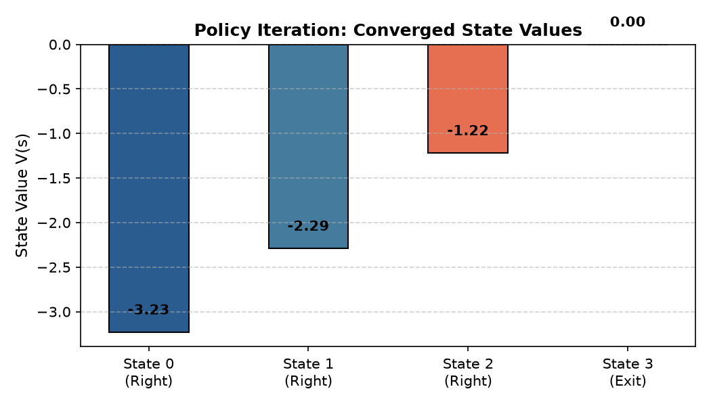
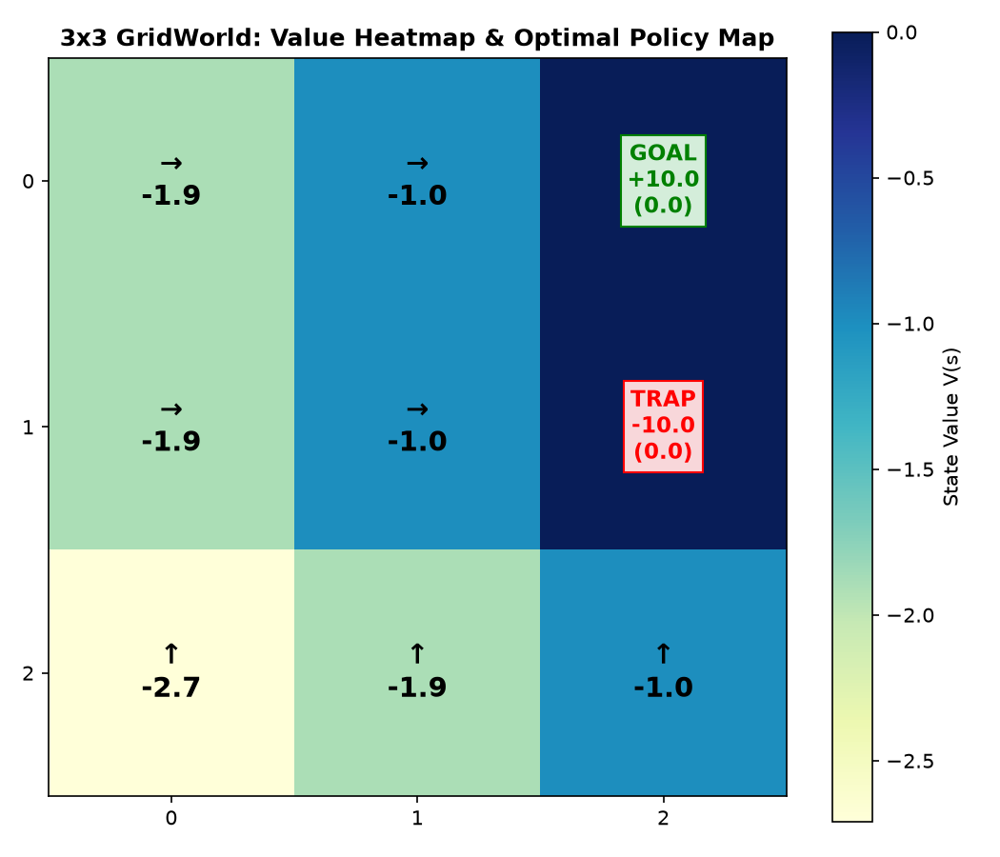

# Dynamic Programming for MDPs: Policy Iteration & Value Iteration

[](https://www.python.org/)
[](https://jupyter.org/)
[](https://numpy.org/)
[](https://matplotlib.org/)
[](https://opensource.org/licenses/MIT)

## Author
- **Shrri Dharshan D R** — [@shrridharshan27](https://github.com/shrridharshan27)
- **Registration Number:** 23BPS1090
- **Course:** Reinforcement Learning Lab (BCSE432E)
- **Lab Slot:** L31+L32

---

## Overview
This repository provides implementations and comparative analyses of two fundamental **Dynamic Programming (DP)** algorithms in Reinforcement Learning:
1. **Policy Iteration (Generalized Policy Iteration - GPI):** Interleaving Policy Evaluation (solving the Bellman Expectation Equation) and Policy Improvement (greedy 1-step lookahead) until policy convergence.
2. **Value Iteration:** Direct application of the Bellman Optimality operator over a 2D $3 \times 3$ GridWorld environment containing rewarding goals, lethal traps, step costs, and boundary wall collisions.

---

## Mathematical Formulation

### 1. Policy Evaluation
Iteratively updates state values for a fixed policy $\pi$:
$$V_{k+1}^{\pi}(s) = R(s, \pi(s)) + \gamma \sum_{s'} P(s' \mid s, \pi(s)) V_k^{\pi}(s')$$

### 2. Policy Improvement
Updates the policy greedily with respect to the evaluated state-value function:
$$\pi'(s) = \arg\max_{a \in \mathcal{A}} \left[ R(s, a) + \gamma \sum_{s'} P(s' \mid s, a) V^{\pi}(s') \right]$$

### 3. Value Iteration (Bellman Optimality Operator)
$$V_{k+1}(s) = \max_{a \in \mathcal{A}} \left[ R(s, a) + \gamma \sum_{s'} P(s' \mid s, a) V_k(s') \right]$$

---

## Experimental Results




### 3x3 GridWorld Optimal Value Matrix
```text
[[ 6.3   7.1  GOAL ]
 [ 4.7   5.4  TRAP ]
 [ 3.2   3.9   2.5 ]]
```

### Optimal Policy Navigation Map
```text
[['→', '→', 'GOAL'],
 ['↑', '↑', 'TRAP'],
 ['↑', '↑', '←']]
```
The derived policy navigates the agent directly toward the GOAL at $(0, 2)$ while safely repelling it from the TRAP at $(1, 2)$.

---

## Project Structure
```text
Policy-and-Value-Iteration-RL/
├── dp/
│   ├── __init__.py
│   ├── policy_iteration.py     # Evaluation & improvement loop
│   └── value_iteration_grid.py # 2D GridWorld VI solver & collision physics
├── assets/
│   ├── policy_iteration_values.png
│   └── gridworld_value_policy.png
├── 23BPS1090_ShrriDharshan_RL_Lab4.ipynb
├── main.py                     # Execution script
├── requirements.txt
├── .gitignore
├── LICENSE
└── README.md
```

---

## Quickstart & Setup

1. **Clone repository:**
   ```bash
   git clone https://github.com/shrridharshan27/Policy-and-Value-Iteration-RL.git
   cd Policy-and-Value-Iteration-RL
   ```

2. **Install requirements:**
   ```bash
   pip install -r requirements.txt
   ```

3. **Run algorithms:**
   ```bash
   python main.py
   ```

4. **Launch Jupyter Notebook:**
   ```bash
   jupyter notebook 23BPS1090_ShrriDharshan_RL_Lab4.ipynb
   ```

---

## License
Distributed under the [MIT License](LICENSE).
